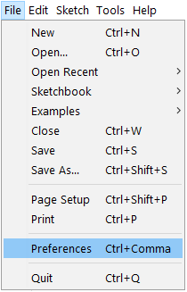
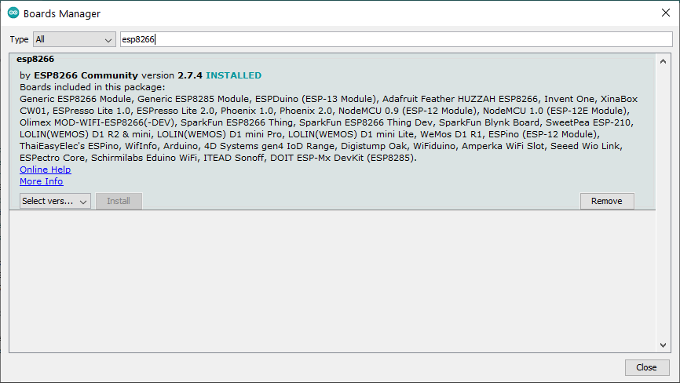
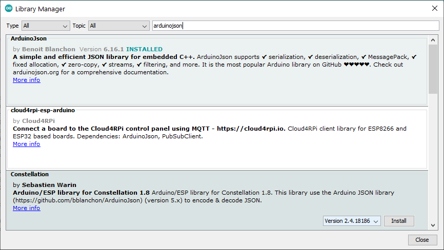
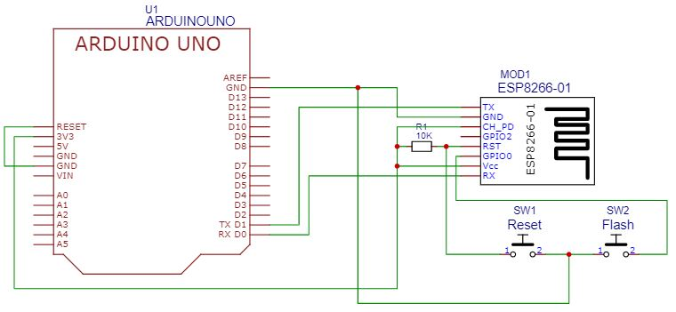
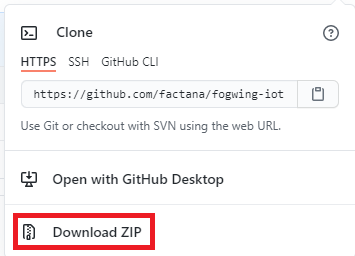
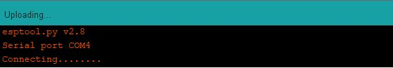
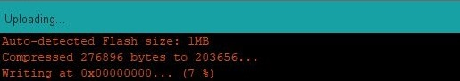
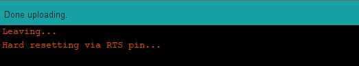
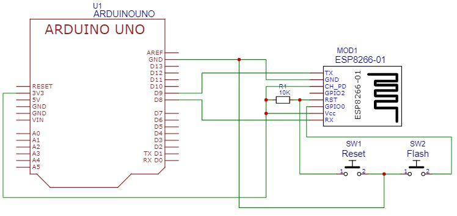

# _Log telemetry data to Fogwing Enterprise Cloud by using Arduino Uno and ESP8266-01_

In this we will explain you how you can connect to [Fogwing](https://enterprise.fogwing.net/) IoT Platform with Arduino & ESP8266-01.

## Step:1
### Hardware requirements:
* Arduino Uno/Nano
* ESP8266-01
* 10K resistor (1qty)
* 2 push buttons
* Breadboard

### Software requirements:
* [Fogwing](https://enterprise.fogwing.net/) enterprise account
* [Arduino IDE](https://www.arduino.cc/en/software)

**Note:** If you do not have Fogwing enterprise account please go through [this](https://www.youtube.com/watch?v=GjsSmuSoE38&feature=youtu.be) video.

## Step:2
### Have the necessary stuffs on Arduino IDE:

The first stuff that we are going to use is the Board Manager for ESP8266 and is given by ESP8266 Community. And the other stuffs are ArduinoJson library to create JSON payload, PubSubClient to manage MQTT. You can refer credits section at the end of this article.

**Note:** Fogwing Enterprise Cloud only excepts data in the JSON format.

* Open the Arduino IDE select **Files -> Preferences** and enter http://arduino.esp8266.com/stable/package_esp8266com_index.json into Additional Board Manager URLs field. You can add multiple URLs, separating them with commas.

  

 

* Open Boards Manager from **Tools -> Board -> Boards Manager** and install esp8266. To simply find the correct one, search esp8266 within the search bar.

  

* Open Library Manager from **Tools -> Manage Libraries** and search for **arduinojson** and **pubsubclient** in the search bar and install both the libraries.

  

## Step:3
### Getting ready with the tools for ESP-01:

* So, by now we have finished installations of necessary libraries. Now we are good to go with the hardware side. For this find the below schematic and have the connections on breadboard.

  

 

* In the schematic we are making use of serial interface of Arduino Uno to flash ESP-01 and with the couple of push buttons it comes easy.

  So before moving further make sure you did it correctly. Have a look at the table.

  |     Arduino Uno    |    ESP8266-01           |
  | -------------------| -----------------------:|
  |   TX D1            |        TX               |
  |   RX D0            |        RX               |
  |   3V3              |        VCC/3V3          |
  |   3V3              | RST through 10K resistor|
  |   3V3              |        CH_PD/EN         |
  |   GND              |         GND             |

  **Fatal warning:** Do not connect ESP-01 VCC to 5V of Arduino Uno ever as ESP-01 will not handle that much voltage and eventually will damage it. But other pins can be 5V tolerant.

  ###### Note: Make sure you have connected RESET of Arduino Uno to GND. By this way we are bypassing Arduino Uno such that it will not interfere in between. And we can flash ESP-01 without any interruption.

* And one more thing make sure you have connected serial pins parallelly as we generally use cross connections for serial interface. i.e. you should connect Arduino Uno TX to ESP-01 TX and Arduino Uno RX to ESP-01 RX. For flashing we will use parallel connection and for communication we will use cross connection.

## Step:4
### Burning the sketch into ESP-01:

* First download the libraries from here. Select Download ZIP to download the library.

  

* To add the downloaded library to Arduino IDE, first extract the downloaded zip file and go to **Sketch >> Include Library >> Add .ZIP Library** then select **arduino_telemetry** and press Open.

  Repeat the above procedure to add the **esp8266-01_client** library.

* Now go to **esp8266-01_client** folder and open the **esp8266-01_client.ino**, update it with your WiFi credentials(i.e. SSID & PASSWORD).

* Open Arduino IDE and use the sketch with necessary header files and select **Tools -> Board -> ESP8266 Boards and select Generic ESP8266 Module** then press **Verify** button in the Arduino IDE to check for any errors (Typo or copy-paste error). If you not got any error then everything is fine.

* Connect Arduino Uno to your computer and then Select **Tools -> Port** and make sure you have selected the correct port. And again, Select **Tools -> Upload Speed** and make sure it is 115200.

* And then press **Upload** button in Arduino IDE it will take some time to complete the process. When you see **Connecting....** on Arduino IDE press and hold **Reset** and **Flash** push buttons for at least 5 seconds then release **Reset** push button while holding **Flash** push button pressed.

  

* When it starts writing the sketch release **Flash** push button and relax. It will take some time to finish.

  

* When you get **Done Uploading** you have finished and ESP-01 is ready with the sketch, press **Reset** push button and follow the procedure given below.

  

* Now you can open **Serial Monitor** and make sure you have set **9600 baud** then type HELLO and press **Send**. If you see **READY** then it is connected to internet and is working. If you see **WERR** then it is not yet connected to the internet. Wait for some time and try again. If it repeats then try connecting to other WiFi device by changing the network name and password in init() method.

  ######  Note: This is one-time process and you need not to do this again and again. Because the sketch is written to handle all the request coming from Arduino Uno.

## Step:5
### Getting ready with the tools for Arduino Uno:

* So, you already have the connections ready but need to make some changes. For this find the below schematic useful. But before moving forward make sure you have disconnected USB cable from your computer.

  

* The changes made in this schematic are
    1. Remove the connection from **RESET** of Arduino Uno to **GND**.
    2. Remove the ESP-01 TX and RX connection and connect it according to the table below.
    
        | Arduino UNO         | ESP8266-01      |
        |---------------------|----------------:|
        |D9 (soft serial RX)  |     TX          |
        |D8 (soft serial TX)  |     RX          |

So, by this we are using cross connection for serial communication.  

## Step:6
### Burning the sketch into Arduino Uno:

* Go to the **arduino_telemetry** folder which you have downloaded in step 4, open the **arduino_telemetry.ino** file and update it with your [Fogwing](https://enterprise.fogwing.net/) MQTT credentials. You should have got an e-mail with all the required details or you can find it in Fogwing IoTHub access.

* Open Arduino IDE and use the above sketch with necessary header files and select **Tools -> Board -> Arduino AVR Boards -> Arduino Uno** then press **Verify** button in the Arduino IDE to check for any errors (Typo or copy-paste error). If you not got any error then everything is fine.

* Connect Arduino Uno to your computer and then Select **Tools -> Port** and make sure you have selected the correct port. And then press **Upload** button in Arduino IDE and wait till it finishes.

  **Note:-** Provided everything goes in line with the above mentioned instructions, you will be able to see the data on [Fogwing](https://enterprise.fogwing.net/) Platform.

## Step:7
### Start analyzing your data at Fogwing Platform:

* Now you are ready to analyze your data at [Fogwing](https://enterprise.fogwing.net/) Platform portal, you can check all the data within the **Data Storage** in the portal.

## Getting help and finding Fogwing docs:
* [Fogwing Platform Forum](https://enterprise.fogwing.net/)
* [Fogwing Platform Docs](https://docs.fogwing.io/fogwing-platform/)
